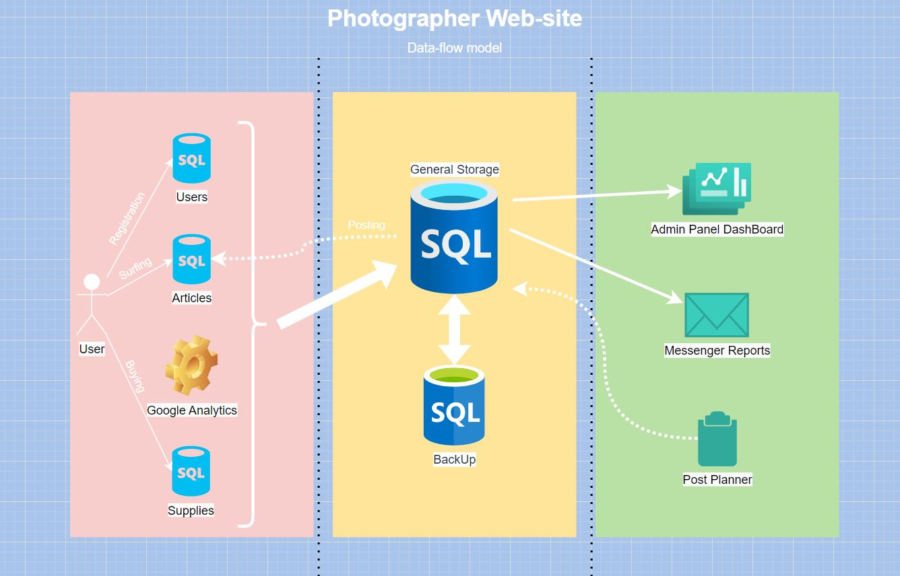
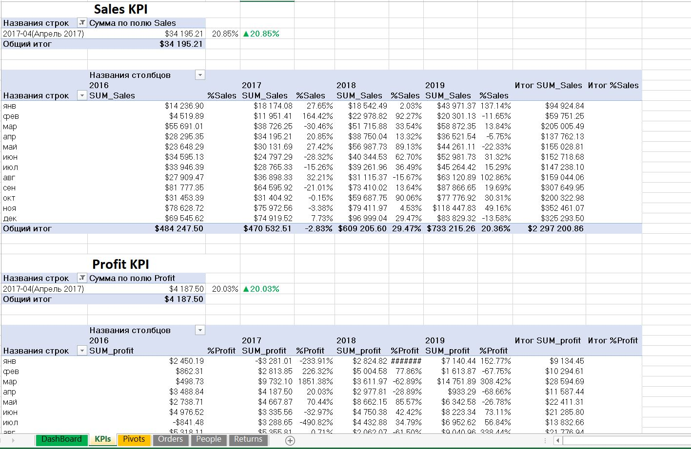

# Самомтоятельная работа 1

## Архитектура аналитического решения

Разрабатывая архетиктуру аналитического решения, я попытался разработать схему для своего проекта.
Получилось вот так:

 

В данной схеме отображена структура сайта для фотографа, где есть блог и "магазин" с пресетами и прочим.

## Создание Dashboard

Первое что хотелось бы сказать - вопреки моим представлениям, Excel я знаю не очень хорошо. В целом, я умею работать со сводными таблицами, графиками и срезами. Но был приятно удивлен что можно реализовывать такие динамические штуки как YoY отдельным элементом, с условным форматированием.
Хочу сказать большое спасибо за столь полезный челлендж :)

Следующее что хотелось бы отметить, это сложность разработки дашборда, когда нет задачи. Поэтому я попытался воткнуть в него то что мне показалось интересно реализовывать.

В зависимости от выбранного среза меняются показатели KPI и данные по регионам

 

А также, распределение по штатам

 

Для реализации показателей по KPI использованы по 2 сводные таблицы

 

И в дополнение, 2 таблицы для графика динамики продаж и профита и распределиния по штатам

 
