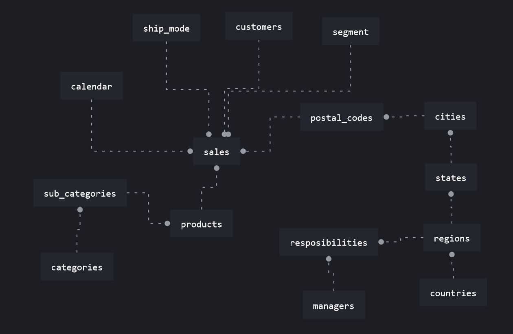
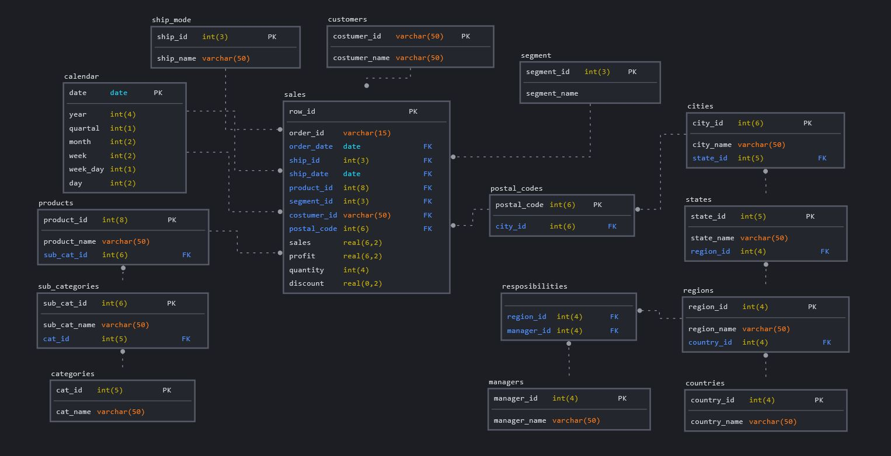

# Базы данных

## 2.1 Установка PostgreSQL

Что ж, начнем. Установка PostgreSQL на Windows вроде не отличается от установки любой другой программы, поэтому здесь все прошло без осложнений.

## 2.2 Подключение и загрузка таблиц в базу данных

### 2.2.1 Подключение

Подключение к базе данных с DBeaver также не вызвало проблем. В видео все очень подробно расказано.

### 2.2.1 Добавление информации из таблиц в БД

Однако добавление данных из таблиц заставило задуматься над поиском более компактного решения.
после 5 минут серфинга в интернете, было решено спользовать `Python` и необходимые модули: `pandas`, `sqlalchemy` (для чтения .xslx файлов `pandas` просит установить модуль `xlrd`

Код можно найти [здесь](./table_creating.py)

Есть один момент: при таком способе добавляется колонка `index`.* Её можно удалить после добавления в БД двумя способами:

* используя команду

    ```SQL
    ALTER TABLE {table_name}
    DROP COLUMN index
    ```

    из DBeaver для каждой таблицы

* или добавить

    ```python
    # получаем список таблиц
    table_names = engine.table_names()

    # подключаемся к БД
    with engine.connect() as conn:

        # для каждой таблицы в списке
        for table in table_names:
            try:
                # удаляем колонку если она есть
                conn.execute(f'''
                                ALTER TABLE {table}
                                DROP COLUMN index
                            ''')
                print(f'deleted from {table}')
                
            except:
                # выводим сообщение что такой колонки в таблице нет
                print(f'there is no "index" in {table}')
    ```

не знаю, на сколько такой подход правильный в реальных условиях, но добавлять вручную построчно 10 000 строк, это не про меня :)**

*upd
помимо лишней колонки, при добавлении данных таким способом возникает проблема с типом данных в колонках, из-за чего некоторые функции (например ROUND и возможно другие) не работают должным образом вызывая ошибки. Для работы с датами, перезалил таблицу `orders` используя скрипт из папки с лабой... (позже победю эту проблему :))

**upd
понял что поторопился, и добавил себе лишних приключений. По другому у меня учиться не получается

## 2.3 Получение данных из БД

параллельно штудируя курс по PostgreSQL и одолевая Google, пробуем получать отчеты из БД (названия колонок в разных отчетах отличаются в виду использования разных способов добавления данных в БД. Впредь, буду осторожнее с такими манипуляциями)

### Overview (обзор ключевых метрик)

#### Total Sales

Суммируем продажи и округляем до целого

```SQL
select round(sum(o."Sales")) as "total sales"
from orders o
```

#### Total Profit

аналогично

```sql
select round(sum(o."Profit")) as "total profit"
from orders o
```

#### Profit Ratio

делим суммы профита и продаж и умножаем на 100

```sql
select round(
       (sum(o."Profit") / sum(o."Sales")
       )*100) as "total sales"
from orders o
```

#### Profit per Order

```sql
select o."Order ID" , 
       round(sum(o."Profit")) as "total profit"
from orders o
group by o."Order ID" 
order by "total profit" desc
```

#### Sales per Customer

```sql
select o."Customer ID", 
       round(sum(o."Profit")) as "total profit"
from orders o
group by o."Customer ID" 
order by "total profit" desc
```

#### Avg. Discount

```sql
select avg(o."Discount") * 100 as "avg discount"
from orders o
```

#### Monthly Sales by Segment

```sql
select extract(month from o.order_date) as "month",
    o.segment ,
    round(sum(o.sales), 2) as "sales"
from orders o 
group by "month", o.segment
order by "month", o.segment
```

#### Monthly Sales by Product Category

```sql
select extract(month from o.order_date) as "month",
    o.category  ,
    round(sum(o.sales), 2) as "sales"
from orders o 
group by "month", o.category 
order by "month", o.category 
```

### Product Dashboard (Продуктовые метрики)

#### Sales by Product Category over time

вля возможности построить график возьмем более мелкий промежуток времени (в неделю)

```sql
select o.category,
    extract(year from o.order_date) as "year",
    extract(week from o.order_date) as "week",
    round(sum(o.sales), 2) as "sales"
from orders o 
group by o.category, "year", "week" 
order by o.category, "year", "week"
```

### Customer Analysis

#### Sales and Profit by Customer

суммарные продажи и профит на клиента

```sql
select o."Customer ID", 
    round(sum(o."Sales")) as "total sales",
    round(sum(o."Profit")) as "total profit"
from orders o
group by o."Customer ID" 
order by "total profit" desc
```

#### Customer Ranking

возьмем средние по продажам и профиту на клиента

```sql
select o.customer_id ,
    round(sum(o.sales), 2) as "sales",
    round(sum(o.profit), 2) as "profit"
from orders o 
group by o.customer_id  
order by "profit" desc
```

#### Sales per region

суммарные продажи по регионам

```sql
select o."Region", 
    round(sum(o."Sales")) as "total sales"
from orders o
group by o."Region" 
order by "total sales" desc
```

## 2.4 структуры данных

Сказать что я замучался, это ничего не сказать.. XD
В общем, можно было взять готовые скрипты и не мучаться, но разве так чму-нибудь можно научиться?

### 2.4.1 Модель БД

С какого-то перепугу, я решил что надо таблицу `orders` разложить на совсем маленькие части с уникальными значениями.
И в целом все выглядит весьма красиво



### 2.4.2 Загрузка данных

Начал загружать данные. С крайними `dimentional` таблицами проблем не было. дальше тоже все вроде было хорошо, но вот с `postal_codes` все пошло совсем не по плану... в результате в таблице `sales` вместо 9994 строк у меня получилось 19294...

В общем.. к четвертому этапу этого замечательного модуля, я для себя определил: сначала повторяем, потом эксперементируем и упрощаем.

А для дальнейшей работы с AWS я возьму заготовки.

Мои тщетные попытки можно посмотреть в этой же папке ([module_2](./))
