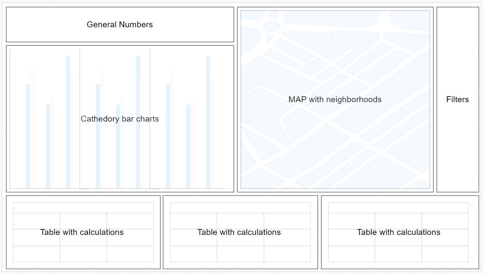

# AirBnB визуализация

## Задача проекта

Создать визуализацию для анализа рынка недвижимости с целью поиска объектов для долгосрочной аренды и заработке на суб-аренде

## Этапы работы

1. Определение необходимой информации для анализа объектов
2. Составление вспомогательных таблиц данных для дальнейшей разработки инструмента
3. Создание предпологаемого макета
4. Реализация дашборда в Tableau

## Приступим

### Ознакомление с имеющимися таблицами

Мы имеем огромную таблицу с информацией по объектам состоящую из 106 колонок.
Определим что нам понадобится для анализа объектов.

1. `id` - для подсчета количества объектов по критериям
2. `listing url` - для ознакомления с конкретным объектом
3. `host_id` - для подсчета количества объектов у каждого арендодателя
4. `neighborhood` - для расчетов по району
5. `latitude`, `logtitude` - для расположения на карте
6. `bathrooms`, `bedrooms`, `beds`, `bed_type`, `square_feet` - для различных срезов
7. `price`, `weekly_price`, `monthly_price`, `security_deposit`, `cleaning_fee` - для расчетев рентабильности
8. `minimum_nights`, `maximum_nights` - для выбора объектов подходящих требованиям
9. `availability_365` - для расчета популярности
10. `review_scores_rating` - для составления рейтинга

Также для анализа сезонности, нам потребуется таблица календарь

### Агрегация данных

Для работы с такой махиной Excel нам не подойдет, поэтому будем использовать Python и Pandas

Преобразования с таблицей можно посмотреть [тут](m3fin_prep.ipynb)

### Загрузка данных в Tableau

Закидываем нашу табличку с отфильтрованными данными, к ней джойним .geojson (джойним чтобы убрать лишние районы) и добавляем календарь.
Этого должно хватить для нашего дашборда.

### Проектирование дашборда

Теперь нужно продумать расположение информации. Для это построим схему расположения элементов используя draw.io

Получается что-то такое

### Реализация

Выполняем все по алгоритму. Составляем необходимые листы с отчетами, и после собираем дашборд

В результате получаем вот такую [штуку](https://public.tableau.com/app/profile/sergei1337/viz/AirBnB_SubRent_Tool/Dashboard1)
