# Визуализация данных

С теорией ознакомился, переходим к практике

## 3.6 Разбор компонентов BI решения на примере Google Data Studio

На сколько я понимаю, здесь все максимально упрощено.

На одной странице происходит подключение к базе данных и выборка данных, которая может осуществлять как просто кликом мышкой, так  с помощью SQL запроса к бд (Авторизация и семантический слой)

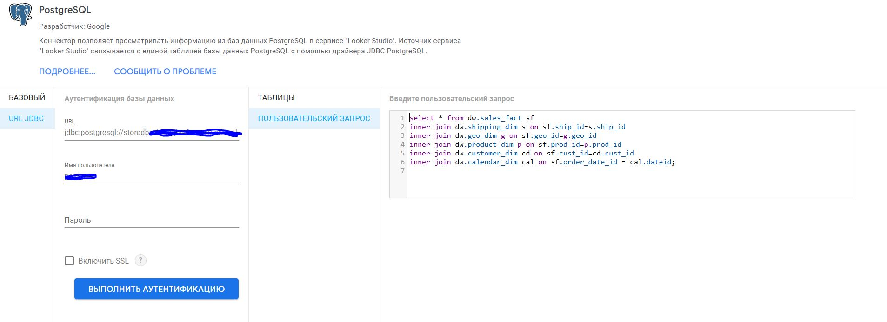

различные шаблоны визуализации можно найти на страрнице редактирования отчета

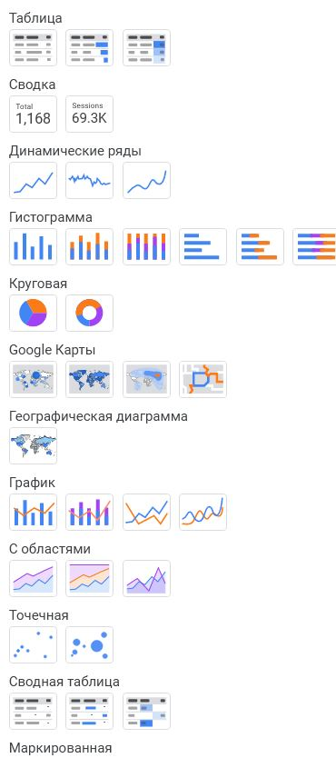

здесь же рядом находятся фильтры

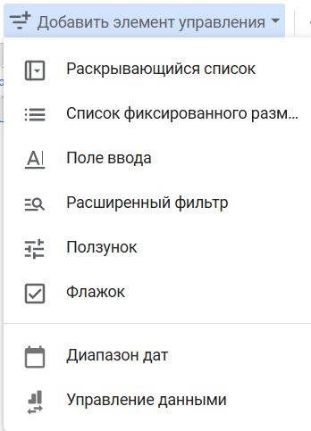

Измерения и показатели выбираются в процессе создания диаграмм

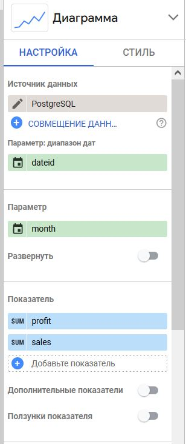

Иерархии здесь не наблюдается - все свалено в одну кучу

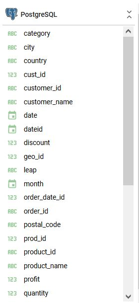

API и интеграция языков программирования отсутствует.
В целом, учитывая доступность и простоту, вполне себе

## 3.7

## 3.8

## 3.9

## 3.10 Знакомство с Power BI

Первое впечатление производит странное. Примерно как Excel - мощный, но тяжелый и неповоротливый. Также, как для человека только знакомящегося с BI инструментами, напрягает реобходимость изучения дополнительных языков (M и DAX). Хорошо что есть возможность делать основные операции с помощью графического интерфейса

Переходим к ДЗ

### 1 преобразование в PowerQuery

Есть соблазн просто переместить необходимые значения в Excel и не мучаться, но что делать если количество ID будет не 21 а 210к и Типов которые надо разделить не 2 а 20...
В общем получилось вот по такому пути:

1. Создаём сводную таблицу
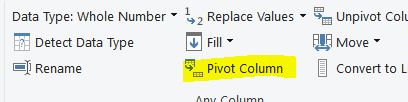
вот с такими параметрами
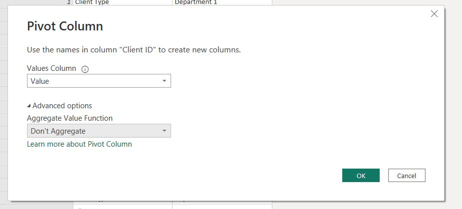
в результате получим вот такую таблицу
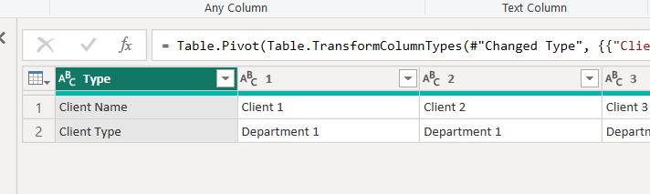
почти то что нужно только горизонтально :)

2. Разворачиваем таблицу используя `Transpose`
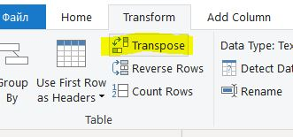
после этого используем певую строку как заголовки
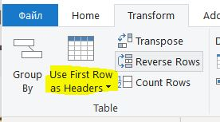
и вот уже больше похоже на то что нужно
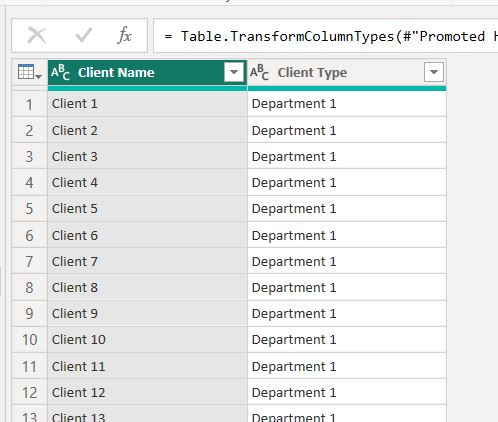

3. Добавляем индексы просто нажимая на `Index Column` и там выбираем `From 1`
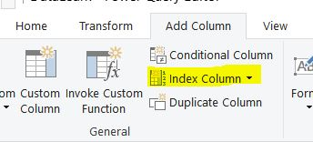

Готово!

### 2

Таблицу с типами категорий делать даже проще

1. Группируем по типу
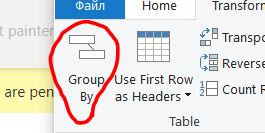
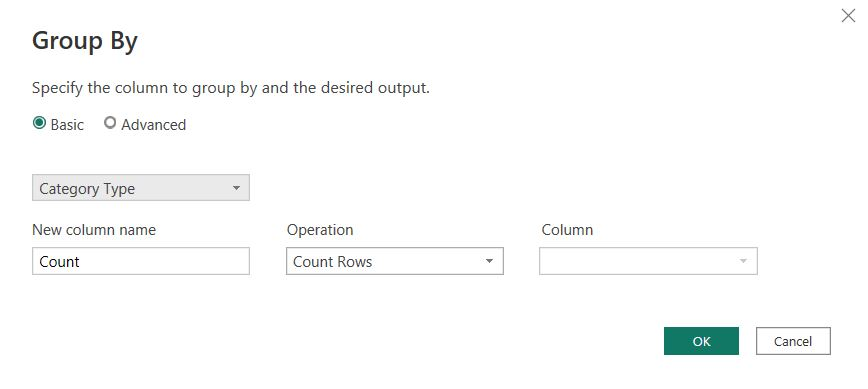

2. Получаем такую таблицу.
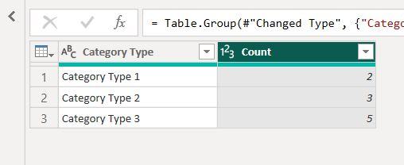
остается удалить лишние колонки и добавить индексы как ID

### 3

А вот здесь с наскоку не получилось. Надо копаться глубже..
За основу пробовал взять MoM % и привести формулу к своим нуждам. Но везде выдает 0.
если решу что буду работать с Power BI то буду углубляться, соответственно.

```DAX
Amount WoW% = 
IF(
 ISFILTERED('Calendar'[Date]),
 ERROR("Time intelligence quick measures can only be grouped or filtered by the Power BI-provided date hierarchy or primary date column."),
 VAR __PREV_week = CALCULATE(SUM('Fact'[Amount]), DATEADD('Calendar'[Date].[Date], -7, DAY)
    )
 RETURN
  DIVIDE(SUM('Fact'[Amount]) - __PREV_week, __PREV_week) * 100
)
```

### 4

Пересчитывать столбец `Ammount` в Power Query не стал, а вот меру сделать получилось :)

Чтобы не менять курс каждый день в ручную использовал JSON, который можно получить здесь `https://www.cbr-xml-daily.ru/daily_json.js`

Добавил источник данных JSON и преобразовал результат в таблицу, после чего добавил значение в формулу

```DAX
Euro price = CALCULATE(DIVIDE(SUM('Fact'[Amount]), LOOKUPVALUE('exchange course'[Value],'exchange course'[Name], "Valute.EUR.Value")))
```
