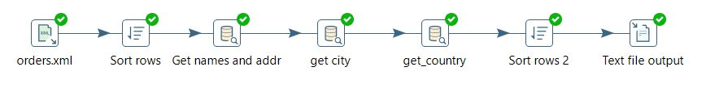
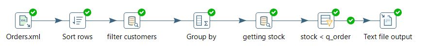
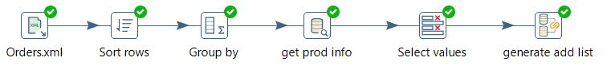
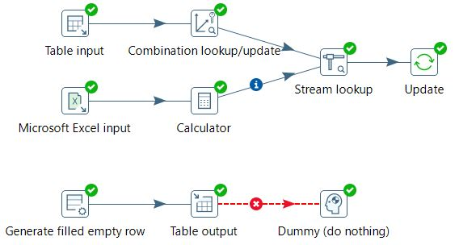
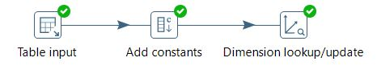

# Упражнение из главы 9

В книге предлагается работать с MySQL. Мне не хотелость ставить еще одну БД, поэтому я реализовал базы данных на используемом ранее локальном сервере Postgres. Переработанные .sql скрипты можно найти в папке [PostgreSQL-scripts](./PostgreSQL-scripts/). Там же `shared.xml` и `kettle.properties` для добавления переменных и базы данных в Pentacho. (подразумевается что база одна, но 2 схемы)

## 01 LookUp базы данных с внешним файлом

Получаем информацию по клиентам сделавшим заказ

Проверяем наличие заказанных товаров на стоке

## 02 Join

Генерация списка возможной замены для товаров которых недостаточное количество на стоке

## 03 Заполнение dim таблиц

Заполнение таблицы местоположений с объединением разных источников

## Slow Change Dimentions

Реализация Type II SCDs

