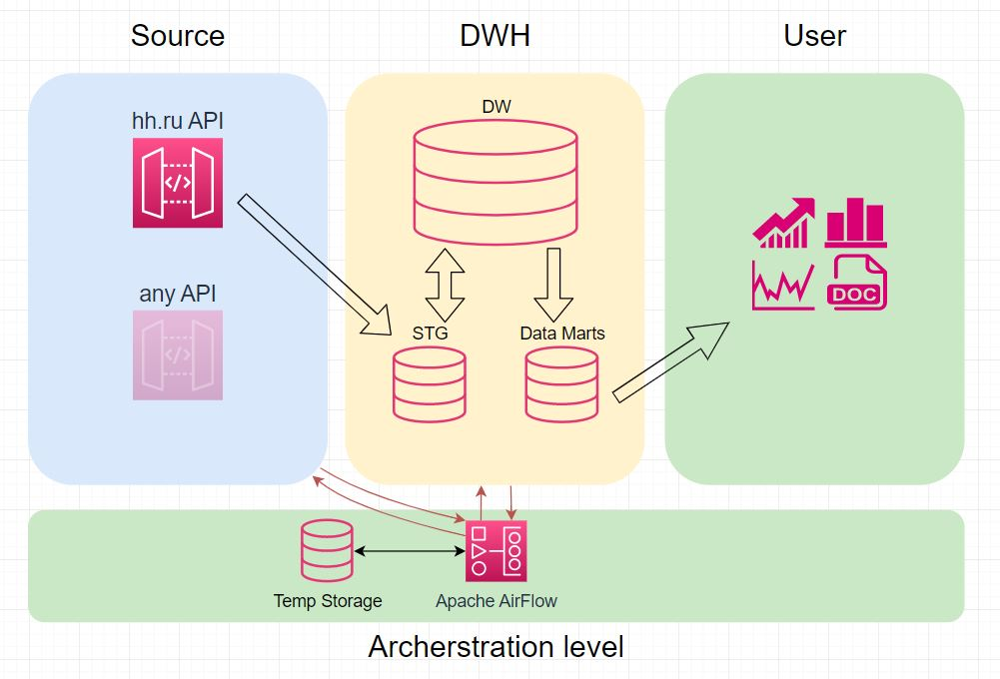

# Реализация ETL процесса на Apache AirFlow

## Задачи проекта

Получить информацию о рынке интересующих вакансий и динамику этого рынка с течением времени

## Этапы разработки

1. ['Разработать схему архетектуры решения'](#разработка-архетектуры-решения)
2. ['Создать схему хранилтща данных'](#создание-схемы-хранилища-данных)
3. ['Определить необходимые этапы ETL-процесса'](#определение-этапов-etl-процесса)
4. ['Разработка ETL процесса'](#разработка-etl-процесса)
5. ['Провести тестирование разработанного конвейера данных'](#тестирование-решения-на-локальной-машине)
6. ['Автономность решения'](#автономность-решения)

## Реализация

Определив цели и этапы приступаем к реализации

### Разработка архетектуры решения

Информацию по интересуюшим нас вакансиям будем получать используя открытый API hh.ru. Используя данный API можно получать данные об открытых вакансиях по нужным критериям формируя запросы. В ответ на запрос сервис предоставляет данные в формате JSON по всем открытим на момент запроса вакансиям. Отслеживая изменения можно составить представление о динамике рынка.

Разработаем схему решения.



На схеме представлен "поток" данных, который полностью управляется Apache Airflow. Сначала данные забираются с помощью API и транформируются на машине с аркестратором и времменым хранилищем. После этого после этого загружаются в STG для дальнейшего заполнения DW. Затем обновляются витрины данных Data Mart и обновляется информация в BI

### Создание схемы хранилища данных

#### Изучение получаемых данных

Для начала определим какие данные мы получаем.

Выполним запрос: `https://api.hh.ru/vacancies?text=data%20engineer&search_field=name` и сохраним полученный [файл](./src/vacancies.json) для анализа

Рассмотрим полученную информацию в сжатом виде

```JSON
"items":{...},
"found":467,
"pages":24,
"per_page":20,
"page":0,
"clusters":null,
"arguments":null,
"alternate_url":"https://hh.ru/search/vacancy?enable_snippets=true&search_field=name&text=data+engineer"}
```

информацию по всем частям можно найти в документации, поэтому, пробежимся по тому что нам интересно:

`items` - словари с информацией о вакансиях
`found` - найденые вакансии
`pages` - доступные страницы

перейдем в items и возьмем что нам нужно из описания вакансий

`id` - id вакансии
`name` - название
`area` - местоположение
`salary` - данные о зарплате
`created_at` - дата создания
`posted_at` - дата размещения
`alternate_url` - ссылка на вакансию на hh.ru
`employer` - информация о работодателе
`schedule` - тип занятости

#### Определяем структуру

Мы будем складывать данные в таблицу staging для хранения всех полученных данных.

Далее мы переносим их в dw где формируем dimensional и fact таблицы.

Учитывая специфику там потребуется сравнивать получаемые и имеющиеся данные между собой чтобы отслеживать изменения в открытых вакансиях и отмечать дату изменений.


### Определение этапов ETL-процесса

### Разработка ETL процесса

### Тестирование решения на локальной машине

### Автономность решения
