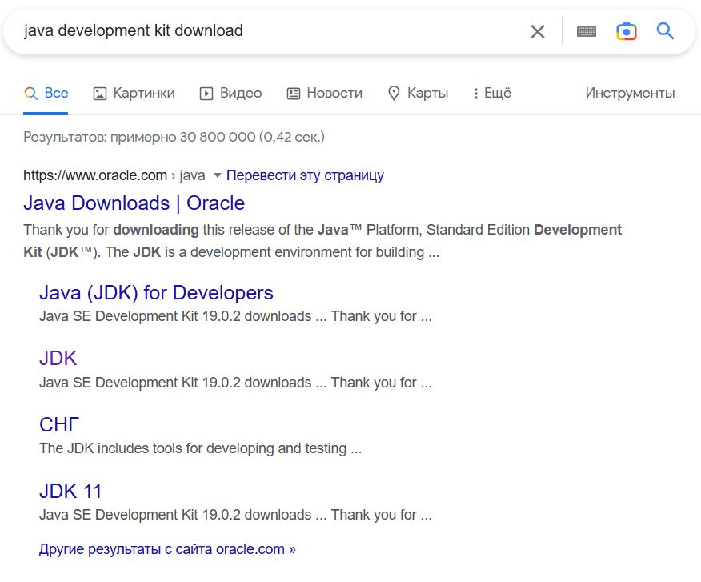
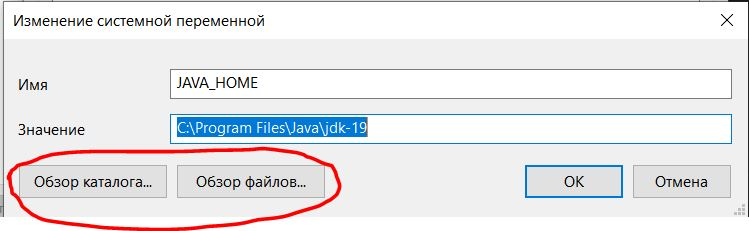
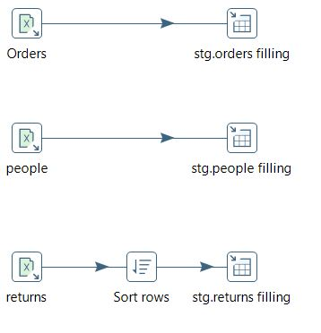
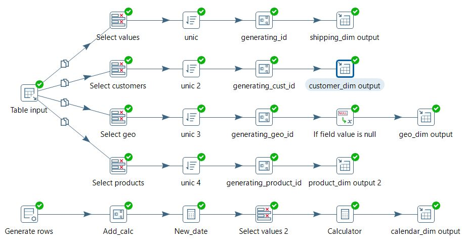
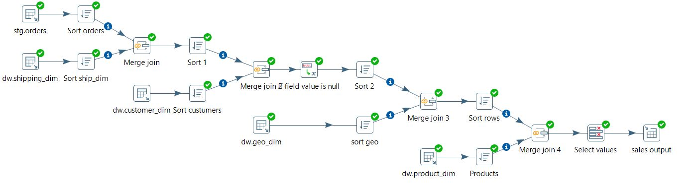
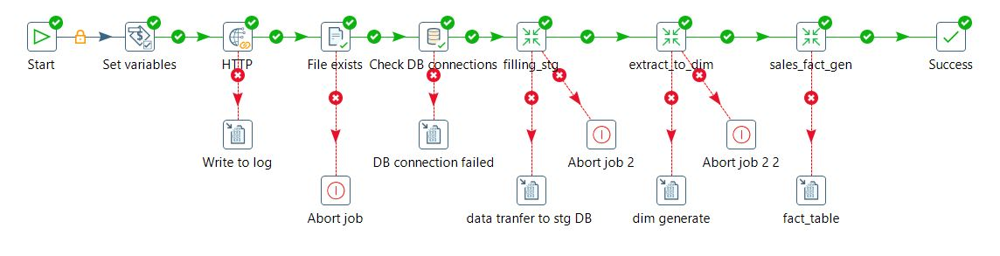

# ETL и ELT

## 4.3 Установка Pentaho

### 1 Скачиваем jdk без регистрации в oracle

У меня не получилось воспользоваться описанным в видео-инструкции способом для того чтобы скачать JDK без регистрации.
Поэтому я пошел другим путем - Googling'ом

Если нажать на `JDK` то попадаем на страницу с загрузками без регистрации. Почему не знаю, но так сработало ([ссылка](https://www.oracle.com/in/java/technologies/downloads/#jdk19-windows))

### 2 Добавление переменных окружения

Здесь тоже возникли проблемы...

Возникала ошибка 'Не удается найти файл.... бла бла бла' при запуске.

Помогло указать пути с помощью кнопок

После этого все запустилось.

## 4.4 Знакомство с Pentaho

Я не стал скачивать трансформации, а просто повторил сам, для лучшего усвоения материала. Все файлы можно найти [здесь](./4-4/).

### Заполнение stg базы

### Создание Dimention таблиц

### Заполнение таблицы фактов

### main job

### Дополнение

Также выполнил преобразования из видео от Павла Новичкова которые лежат [здесь](./pentaho_intro/novickov_pjct/) со скринами

## 4.5 ETL-подсистемы

Выполненное задание из 9-й главы можно посмотреть [здесь](./4-5/)

## 4.6

Data prep инструменты пока не нахожу интересными..

## 4.7 Fancy ETL

А вот AirFlow я поковыряю :-)

описание реализованного проекта можно найти в этом [разделе](./4-7-airflow-pjct/)
